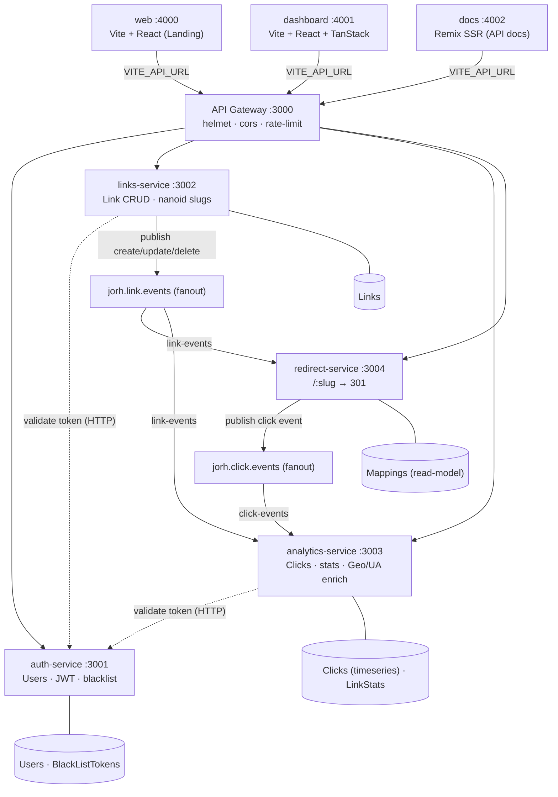

# Jorh

A production-grade URL shortening platform built as a **Turborepo monorepo**. Five independent Node.js microservices communicate through an API gateway and RabbitMQ, with three frontend applications sharing typed packages.

---

## Table of Contents

- [Architecture](#architecture)
- [Repository Structure](#repository-structure)
- [Tech Stack](#tech-stack)
- [Prerequisites](#prerequisites)
- [Local Development](#local-development)
- [Environment Variables](#environment-variables)
- [Services Reference](#services-reference)
- [API Reference](#api-reference)
- [Event Flows (RabbitMQ)](#event-flows-rabbitmq)
- [Data Models](#data-models)
- [Shared Packages](#shared-packages)
- [Docker](#docker)
- [CI/CD](#cicd)
- [Project Decisions](#project-decisions)

---

## Architecture



### Key Design Decisions

**Redirect service maintains its own read-model.** When a link is created, updated, or deleted, the links-service publishes an event. The redirect-service keeps a local `Mapping` collection (a projection of active links) so that `GET /:slug` is a single MongoDB read with no synchronous cross-service HTTP call in the critical redirect path.

**Click tracking is fire-and-forget.** The redirect-service publishes a click event after returning the 301 — the HTTP response is never delayed by analytics writes. The analytics-service enriches and records the click asynchronously.

**Token validation is centralised.** The `createAuthMiddleware` factory calls `GET AUTH_SERVICE_URL/api/users/profile` on every protected request. No JWT signing secrets are distributed to individual services, and token blacklisting (logout) is enforced consistently.

---

## Repository Structure

```
jorh/
├── apps/
│   ├── api-gateway/          # Express reverse proxy (port 3000)
│   ├── auth-service/         # Users, JWT, token blacklist (port 3001)
│   ├── links-service/        # Short link CRUD (port 3002)
│   ├── analytics-service/    # Click recording & stats (port 3003)
│   ├── redirect-service/     # Slug → 301 redirect (port 3004)
│   ├── web/                  # Landing page SPA (port 4000)
│   ├── dashboard/            # User dashboard SPA (port 4001)
│   └── docs/                 # API documentation SSR (port 4002)
│
├── packages/
│   ├── api-client/           # TypeScript SDK for frontend apps
│   ├── ui/                   # Shared React component library
│   ├── shared-auth/          # JWT helpers + auth middleware factory
│   ├── shared-db/            # MongoDB connection wrapper
│   ├── shared-env/           # Env schema, validation, SERVICE_PORTS
│   ├── shared-errors/        # Error classes + Express error handler
│   ├── shared-logger/        # Pino logger + HTTP middleware
│   ├── shared-messaging/     # RabbitMQ pub/sub (amqplib)
│   ├── typescript-config/    # Shared tsconfig bases
│   └── eslint-config/        # Shared ESLint rules
│
├── .github/workflows/
│   └── docker.yml            # Build · Push · Deploy all 8 services
├── docker-compose.yml        # Full local stack
├── turbo.json
├── pnpm-workspace.yaml
└── .env.example
```

---

## Tech Stack

| Layer            | Technology                                            |
| ---------------- | ----------------------------------------------------- |
| Monorepo         | Turborepo + pnpm workspaces                           |
| Backend          | Node.js 18+, Express 5, ESM                           |
| Database         | MongoDB (Mongoose 8)                                  |
| Messaging        | RabbitMQ 3.13 — amqplib, fanout exchanges             |
| Auth             | JSON Web Tokens + bcrypt                              |
| Frontend         | React 18, Vite, TanStack Router, TanStack Query v5    |
| Docs             | Remix v2 (SSR)                                        |
| Styling          | Tailwind CSS, class-variance-authority                |
| Logging          | Pino + pino-http                                      |
| Geo / UA         | geoip-lite, ua-parser-js                              |
| Containerisation | Docker multi-stage builds                             |
| Web server       | nginx:alpine (frontends), node:alpine (backends)      |
| CI/CD            | GitHub Actions → Google Artifact Registry → Cloud Run |

---

## Prerequisites

| Tool                    | Minimum version           |
| ----------------------- | ------------------------- |
| Node.js                 | 18                        |
| pnpm                    | 11.1.1                    |
| Docker + Docker Compose | any recent                |
| MongoDB                 | 6+ (local or Atlas)       |
| RabbitMQ                | 3.13 (local or CloudAMQP) |

```bash
npm install -g pnpm@11.1.1
```

---

## Local Development

### 1. Clone and install

```bash
git clone https://github.com/subhan-f/Jorh.git
cd Jorh
pnpm install
```

### 2. Configure environment

```bash
cp .env.example .env
# Fill in MONGO_URI, RABBITMQ_URI, and JWT secrets at minimum
```

See [Environment Variables](#environment-variables) for the full reference.

### 3a. Full stack with Docker Compose

Builds all 8 services from source and starts a managed RabbitMQ instance. MongoDB is **not** included — point `MONGO_URI` at Atlas or a separately managed instance.

```bash
docker compose up --build
```

| URL                    | Service                             |
| ---------------------- | ----------------------------------- |
| http://localhost:3000  | API Gateway                         |
| http://localhost:4000  | Web (landing page)                  |
| http://localhost:4001  | Dashboard                           |
| http://localhost:4002  | Docs                                |
| http://localhost:15672 | RabbitMQ management (guest / guest) |

### 3b. Dev mode with Turborepo

Starts all services simultaneously with hot reload:

```bash
pnpm dev
```

Target a single app:

```bash
pnpm --filter dashboard dev
pnpm --filter links-service dev
```

### Useful commands

```bash
pnpm build          # Build all apps and packages
pnpm check-types    # TypeScript check across the whole repo
pnpm lint           # ESLint across all packages
pnpm format         # Prettier format
```

---

## Environment Variables

Copy `.env.example` to `.env`. All backend services consume configuration through `@repo/shared-env`, which validates required variables, applies defaults, and returns a frozen config object.

### Infrastructure — required by multiple services

| Variable       | Required | Default       | Description                                      |
| -------------- | -------- | ------------- | ------------------------------------------------ |
| `MONGO_URI`    | Yes      | —             | MongoDB connection string                        |
| `RABBITMQ_URI` | Yes\*    | —             | RabbitMQ AMQP URI (\*not needed by auth-service) |
| `NODE_ENV`     | No       | `development` | Runtime environment                              |

### Service ports

| Variable                 | Default |
| ------------------------ | ------- |
| `API_GATEWAY_PORT`       | `3000`  |
| `AUTH_SERVICE_PORT`      | `3001`  |
| `LINKS_SERVICE_PORT`     | `3002`  |
| `ANALYTICS_SERVICE_PORT` | `3003`  |
| `REDIRECT_SERVICE_PORT`  | `3004`  |

### Auth service

| Variable                 | Required | Default | Description                               |
| ------------------------ | -------- | ------- | ----------------------------------------- |
| `JWT_ACCESS_SECRET`      | Yes      | —       | Signing secret for access tokens          |
| `JWT_ACCESS_EXPIRATION`  | No       | `30m`   | Access token lifetime (e.g. `15m`, `1h`)  |
| `JWT_REFRESH_SECRET`     | Yes      | —       | Signing secret for refresh tokens         |
| `JWT_REFRESH_EXPIRATION` | No       | `30d`   | Refresh token lifetime (e.g. `7d`, `30d`) |

### API gateway

| Variable                | Required | Description                             |
| ----------------------- | -------- | --------------------------------------- |
| `CORS_ORIGINS`          | No       | Comma-separated list of allowed origins |
| `AUTH_SERVICE_URL`      | Yes      | Internal URL of auth-service            |
| `LINKS_SERVICE_URL`     | Yes      | Internal URL of links-service           |
| `ANALYTICS_SERVICE_URL` | Yes      | Internal URL of analytics-service       |
| `REDIRECT_SERVICE_URL`  | Yes      | Internal URL of redirect-service        |

### Links, analytics services

| Variable           | Required | Description                                |
| ------------------ | -------- | ------------------------------------------ |
| `AUTH_SERVICE_URL` | Yes      | Used by auth middleware to validate tokens |

### Frontend — baked at image build time

`VITE_*` variables are embedded into the JavaScript bundle by Vite at build time. Passing them at container runtime with `-e` has no effect — always supply them as Docker `--build-arg`.

| Variable             | Default                 | Used by              |
| -------------------- | ----------------------- | -------------------- |
| `VITE_API_URL`       | `http://localhost:3000` | web, dashboard, docs |
| `VITE_DASHBOARD_URL` | `http://localhost:4001` | web (CTA links)      |
| `VITE_DOCS_URL`      | `http://localhost:4002` | web (docs link)      |

### Docs server — runtime

| Variable       | Default                 | Description                                 |
| -------------- | ----------------------- | ------------------------------------------- |
| `API_BASE_URL` | `http://localhost:3000` | Public gateway URL displayed in the docs UI |

---

## Services Reference

### api-gateway (port 3000)

Single entry point for all client traffic. Applies Helmet security headers, CORS, and a global rate limiter, then proxies requests using `http-proxy-middleware`.

**Routing table:**

| Path prefix        | Proxied to        | Notes                                                   |
| ------------------ | ----------------- | ------------------------------------------------------- |
| `/api/auth/*`      | auth-service      | Stricter per-IP rate limiter                            |
| `/api/users/*`     | auth-service      |                                                         |
| `/api/links/*`     | links-service     |                                                         |
| `/api/analytics/*` | analytics-service |                                                         |
| `/:slug`           | redirect-service  | Catch-all, registered after `/api`                      |
| `GET /health`      | —                 | Returns `{ success: true, message: "pong", timestamp }` |

---

### auth-service (port 3001)

Handles user registration, login, token issuance, and logout. Does not connect to RabbitMQ.

- **Passwords** hashed with bcrypt before storage. Never returned in API responses.
- **Avatar** auto-generated as a Gravatar URL from the user's email hash.
- **Logout** adds the token to a `BlackListToken` collection with a TTL index that matches the token's expiry — MongoDB automatically deletes the document after the token would have expired anyway.
- **Token validation** by other services makes an HTTP call to `GET /api/users/profile` on this service, which checks the blacklist and returns the user object if valid.

---

### links-service (port 3002)

Manages short links. All routes require authentication.

- **Slug generation**: 7-character nanoid unless a custom slug is provided. Duplicate slugs return a 409 with a user-friendly message.
- **Expiry default**: 30 days from creation when not specified.
- **On every write** (create / update / delete), publishes to the `jorh.link.events` fanout exchange so downstream services stay in sync asynchronously.

---

### analytics-service (port 3003)

Aggregates click data. Accepts no external write requests — all data arrives via RabbitMQ.

**On click event received:**

1. Enriches the raw payload with country/city (geoip-lite) and device/browser/OS (ua-parser-js).
2. Writes a `Click` document to a MongoDB time-series collection (timeField: `timestamp`, granularity: seconds).
3. Determines uniqueness: first click from this IP for this slug counts as unique.
4. Updates `LinkStats` with a MongoDB aggregation pipeline update (`updatePipeline: true`):
   - Increments `totalClicks` and conditionally `uniqueClicks`
   - Sets `lastClickAt`
   - Upserts today's entry in `dailyClicks[]`
   - Upserts entries in `topReferrers[]` and `topCountries[]`
   - Increments device, browser, and OS counters

**On link delete event:** Removes the corresponding `LinkStats` document.

Read endpoints (`GET /api/analytics/*`) are authenticated and return the pre-aggregated stats or paginated raw click history.

---

### redirect-service (port 3004)

Handles the performance-critical redirect path.

- **Local Mapping cache**: Subscribes to `jorh.link.events` and keeps a local `Mapping` collection synced. Every redirect is a single document read — no HTTP call to links-service.
- **Click tracking**: After issuing the 301, asynchronously publishes `{ slug, ip, userAgent, referrer }` to `jorh.click.events`. The response is never blocked.
- **IP extraction**: Reads `X-Forwarded-For` header (trust proxy is enabled), takes the first IP, and strips IPv4-mapped IPv6 prefixes (`::ffff:`) before geo lookup.
- **Inactive / expired links**: Returns 404 when `isActive` is false or `expiresAt` has passed.

---

### web (port 4000)

Static landing page (Vite + React). Links to the dashboard and docs. Served from nginx:alpine on port 8080 in Docker. Fully responsive.

---

### dashboard (port 4001)

User-facing SPA (Vite + React + TanStack Router + TanStack Query v5). Requires authentication. Fully responsive with a mobile slide-out sidebar.

| Route          | Description                                                                                                                 |
| -------------- | --------------------------------------------------------------------------------------------------------------------------- |
| `/login`       | Sign in                                                                                                                     |
| `/register`    | Create account                                                                                                              |
| `/links`       | All links — create, edit, toggle active/inactive, delete, filter by tag                                                     |
| `/links/:slug` | Link detail — stats cards, daily bar chart, top referrers, top countries, device/browser breakdown, paginated click history |
| `/settings`    | Profile management                                                                                                          |

Uses `@repo/api-client` with `VITE_API_URL` as the base URL. The access token is stored in `localStorage` and attached as a `Bearer` header on every API request.

---

### docs (port 4002)

API reference documentation (Remix v2, SSR). Provides endpoint specs, code examples (curl / JavaScript), parameter tables, and response schemas. Has a mobile drawer sidebar. Served by `remix-serve` on port 8080.

---

## API Reference

All requests go through the API gateway (`http://localhost:3000`). Protected routes require:

```
Authorization: Bearer <accessToken>
```

### Authentication

| Method  | Path                 | Auth | Body                           |
| ------- | -------------------- | ---- | ------------------------------ |
| `POST`  | `/api/auth/register` | No   | `{ name, email, password }`    |
| `POST`  | `/api/auth/login`    | No   | `{ email, password }`          |
| `POST`  | `/api/auth/logout`   | Yes  | —                              |
| `GET`   | `/api/users/profile` | Yes  | —                              |
| `PATCH` | `/api/users/profile` | Yes  | `{ name?, email?, password? }` |

### Links

| Method   | Path               | Auth | Body / Query                                                    |
| -------- | ------------------ | ---- | --------------------------------------------------------------- |
| `GET`    | `/api/links/`      | Yes  | —                                                               |
| `POST`   | `/api/links`       | Yes  | `{ originalUrl, slug?, title?, tags?, expiresAt? }`             |
| `GET`    | `/api/links/:slug` | Yes  | —                                                               |
| `PATCH`  | `/api/links/:slug` | Yes  | `{ originalUrl?, slug?, title?, tags?, expiresAt?, isActive? }` |
| `DELETE` | `/api/links/:slug` | Yes  | —                                                               |

### Analytics

| Method | Path                          | Auth | Query                                    |
| ------ | ----------------------------- | ---- | ---------------------------------------- |
| `GET`  | `/api/analytics/stats/:slug`  | Yes  | —                                        |
| `GET`  | `/api/analytics/clicks/:slug` | Yes  | `page` (default 1), `limit` (default 20) |

### Redirect

| Method | Path     | Auth | Response                        |
| ------ | -------- | ---- | ------------------------------- |
| `GET`  | `/:slug` | No   | `301` to original URL, or `404` |

### Response envelope

All API responses use this shape:

```json
{
  "success": true,
  "result": {},
  "message": "optional"
}
```

Error responses:

```json
{
  "success": false,
  "message": "Human-readable description",
  "statusCode": 409
}
```

**Standard status codes:**

| Code | Meaning                            |
| ---- | ---------------------------------- |
| 400  | Bad request / validation error     |
| 401  | Missing or invalid token           |
| 403  | Forbidden                          |
| 404  | Resource not found                 |
| 409  | Conflict (e.g. slug already taken) |
| 429  | Rate limit exceeded                |
| 500  | Internal server error              |

---

## Event Flows (RabbitMQ)

Both exchanges use the **fanout** pattern with durable queues, persistent messages, and `prefetch=1`. Failed handlers nack without requeue.

### `jorh.link.events`

**Published by:** links-service  
**Consumed by:** redirect-service (`redirect.link-events`), analytics-service (`analytics.link-events`)

```json
{
  "slug": "abc1234",
  "originalUrl": "https://example.com/long/path",
  "expiresAt": "2025-07-14T00:00:00.000Z",
  "isActive": true,
  "action": "create | update | delete"
}
```

| Consumer          | `create`       | `update`       | `delete`         |
| ----------------- | -------------- | -------------- | ---------------- |
| redirect-service  | Insert Mapping | Update Mapping | Delete Mapping   |
| analytics-service | No-op          | No-op          | Delete LinkStats |

### `jorh.click.events`

**Published by:** redirect-service  
**Consumed by:** analytics-service (`analytics.click-events`)

```json
{
  "slug": "abc1234",
  "ip": "203.0.113.42",
  "userAgent": "Mozilla/5.0 (iPhone; CPU iPhone OS 17_0...",
  "referrer": "https://twitter.com"
}
```

The analytics-service enriches this with geo data and UA parsing, writes a `Click` document, and updates `LinkStats`.

---

## Data Models

### User (auth-service)

| Field                    | Type              | Notes                                |
| ------------------------ | ----------------- | ------------------------------------ |
| `_id`                    | ObjectId          |                                      |
| `name`                   | String            | required                             |
| `email`                  | String            | required, unique                     |
| `password`               | String            | bcrypt hash, excluded from responses |
| `avatar`                 | String            | Gravatar URL, auto-generated         |
| `role`                   | `user` \| `admin` | default: `user`                      |
| `createdAt`, `updatedAt` | Date              | Mongoose timestamps                  |

### BlackListToken (auth-service)

| Field       | Type   | Notes                                                |
| ----------- | ------ | ---------------------------------------------------- |
| `token`     | String | unique, indexed                                      |
| `expiresAt` | Date   | TTL index — document auto-deleted after token expiry |

### Link (links-service)

| Field                    | Type     | Notes                           |
| ------------------------ | -------- | ------------------------------- |
| `_id`                    | ObjectId |                                 |
| `slug`                   | String   | unique; 7-char nanoid or custom |
| `user`                   | ObjectId | ref User                        |
| `originalUrl`            | String   | required                        |
| `title`                  | String   | optional display name           |
| `tags`                   | String[] | optional                        |
| `expiresAt`              | Date     | default: now + 30 days          |
| `isActive`               | Boolean  | default: `true`                 |
| `createdAt`, `updatedAt` | Date     |                                 |

### Mapping (redirect-service — read-model of Link)

| Field         | Type    | Notes                     |
| ------------- | ------- | ------------------------- |
| `_id`         | String  | slug (string primary key) |
| `originalUrl` | String  |                           |
| `expiresAt`   | Date    |                           |
| `isActive`    | Boolean |                           |

### Click (analytics-service — time-series collection)

| Field        | Type   | Notes                                         |
| ------------ | ------ | --------------------------------------------- |
| `slug`       | String | indexed, time-series `metaField`              |
| `timestamp`  | Date   | time-series `timeField`, granularity: seconds |
| `ip`         | String | IPv4, after `::ffff:` stripping               |
| `userAgent`  | String |                                               |
| `referrer`   | String |                                               |
| `country`    | String | from geoip-lite                               |
| `city`       | String | from geoip-lite                               |
| `deviceType` | String | `mobile` \| `desktop` \| `tablet`             |
| `browser`    | String | from ua-parser-js                             |
| `os`         | String | from ua-parser-js                             |

### LinkStats (analytics-service — aggregated per slug)

| Field              | Type                                    | Notes              |
| ------------------ | --------------------------------------- | ------------------ |
| `slug`             | String                                  | unique             |
| `totalClicks`      | Number                                  |                    |
| `uniqueClicks`     | Number                                  | one per unique IP  |
| `lastClickAt`      | Date \| null                            |                    |
| `dailyClicks`      | `[{ date: string, count: number }]`     | date: `YYYY-MM-DD` |
| `topReferrers`     | `[{ referrer: string, count: number }]` |                    |
| `topCountries`     | `[{ country: string, count: number }]`  |                    |
| `devices`          | `{ mobile, desktop, tablet }`           |                    |
| `browsers`         | `Map<string, number>`                   |                    |
| `operatingSystems` | `Map<string, number>`                   |                    |

---

## Shared Packages

### `@repo/shared-env`

Env validation and config factory. Each service calls `createConfig(process.env, { required: [...] })` which validates required variables, applies defaults, coerces types (PORT to number, CORS_ORIGINS to array), and returns a frozen object.

```js
import { createConfig } from "@repo/shared-env";
const config = createConfig(process.env, {
  required: ["MONGO_URI", "RABBITMQ_URI"],
});
// config.MONGO_URI, config.PORT, config.NODE_ENV, etc.
```

Also exports `SERVICE_PORTS` — a frozen object with the default port for each service.

---

### `@repo/shared-auth`

```js
import { createAuthMiddleware, createTokenHelpers } from "@repo/shared-auth";

// auth-service: generate and verify tokens
const { generateAccessToken, verifyAccessToken } = createTokenHelpers(config);
const token = generateAccessToken({ userId, email, role });

// Any protected service: validate incoming requests
app.use(createAuthMiddleware(config.AUTH_SERVICE_URL));
// Sets req.user on success, returns 401/503 on failure
```

`createAuthMiddleware` extracts the token from `cookies.accessToken` or the `Authorization: Bearer` header, then calls `GET {AUTH_SERVICE_URL}/api/users/profile`.

---

### `@repo/shared-messaging`

```js
import {
  connectMQ,
  publishEvent,
  subscribeToEvent,
  EXCHANGES,
} from "@repo/shared-messaging";

await connectMQ(config.RABBITMQ_URI);

// Publisher (fire-and-forget)
await publishEvent(EXCHANGES.LINK_EVENTS, {
  slug,
  originalUrl,
  action: "create",
});

// Subscriber (durable queue, ack on success, nack on error)
await subscribeToEvent(
  EXCHANGES.CLICK_EVENTS,
  "analytics.click-events",
  async (msg) => {
    await clickService.recordClick(msg);
  },
);
```

| Constant                 | Exchange name       |
| ------------------------ | ------------------- |
| `EXCHANGES.LINK_EVENTS`  | `jorh.link.events`  |
| `EXCHANGES.CLICK_EVENTS` | `jorh.click.events` |

---

### `@repo/shared-errors`

```js
import {
  ConflictError,
  NotFoundError,
  createErrorHandler,
} from "@repo/shared-errors";

throw new ConflictError(`The slug "${slug}" is already taken.`);
throw new NotFoundError("Link not found.");

// Register last in Express app
app.use(createErrorHandler(logger));
```

Available classes: `AppError`, `BadRequestError` (400), `UnauthorizedError` (401), `ForbiddenError` (403), `NotFoundError` (404), `ConflictError` (409), `ValidationError` (422), `ServiceUnavailableError` (503).

---

### `@repo/api-client`

Typed TypeScript SDK used by all three frontend apps.

```ts
import { createClient } from "@repo/api-client";

const jorh = createClient(import.meta.env.VITE_API_URL, storedToken);

// Auth
const { result } = await jorh.auth.login({ email, password });

// Links
const { result: links } = await jorh.links.list();
await jorh.links.create({
  originalUrl: "https://example.com",
  slug: "my-link",
  tags: ["work"],
});
await jorh.links.update("my-link", {
  isActive: false,
  expiresAt: "2025-12-31T00:00:00Z",
});
await jorh.links.delete("my-link");

// Analytics
const { result: stats } = await jorh.analytics.getLinkStats("my-link");
const { result: clicks, total } = await jorh.analytics.getClickHistory(
  "my-link",
  { page: 1, limit: 20 },
);
```

---

### `@repo/ui`

Tailwind component library shared across web, dashboard, and docs. Components are tree-shaken at build time.

Available: `Avatar`, `Badge`, `Button`, `Card`, `Dialog`, `Input`, `Label`, `Separator`, `Skeleton`, `Table`, `Tabs`, `Textarea`, `Toast`.

---

## Docker

### Multi-stage build strategy

All Dockerfiles use three stages:

1. **pruner** — runs `turbo prune <service> --docker` to produce a minimal subset of the monorepo (only files and packages this service actually needs). This keeps cache hits high: changing an unrelated service doesn't invalidate this layer.
2. **builder** — installs dependencies with `pnpm install --frozen-lockfile`, then builds. Frontend stages accept `VITE_*` build args here.
3. **runner** — minimal production image (`node:alpine` for backends, `nginx:alpine` for frontends). Copies only the build output from the builder stage.

### Building a single image

```bash
# Backend service
docker build -f apps/links-service/Dockerfile -t jorh/links-service .

# Frontend — VITE_* must be build args, not runtime env vars
docker build \
  -f apps/dashboard/Dockerfile \
  --build-arg VITE_API_URL=https://api.jorh.io \
  -t jorh/dashboard .
```

### Docker Compose

```bash
# Start the full stack (builds all images from source)
docker compose up --build

# Detached
docker compose up -d --build

# Tail a specific service
docker compose logs -f analytics-service

# Tear down including volumes
docker compose down -v
```

**Port mapping:**

| Container           | Host port | Notes                           |
| ------------------- | --------- | ------------------------------- |
| api-gateway         | 3000      |                                 |
| web                 | 4000      | nginx proxies 4000 → 8080       |
| dashboard           | 4001      | nginx proxies 4001 → 8080       |
| docs                | 4002      | remix-serve proxies 4002 → 8080 |
| rabbitmq AMQP       | 5672      |                                 |
| rabbitmq management | 15672     | guest / guest                   |

MongoDB is **not** included in docker-compose — use Atlas or run a local instance separately.

---

## CI/CD

### Pipeline: `.github/workflows/docker.yml`

Triggers on push to `main` and on pull requests targeting `main`.

Runs **8 parallel jobs** — one per service — each following this sequence:

```
Checkout
  → Authenticate to Google Cloud (OIDC Workload Identity — no long-lived secrets)
  → Set up Docker Buildx
  → Configure Docker for Artifact Registry
  → Extract image metadata  (sha-<short> tag + "latest" on main pushes)
  → Resolve VITE_* build args  (web / dashboard / docs only)
  → Build + cache  (GitHub Actions cache, scoped per service)
  → Push to Artifact Registry          ← skipped on pull requests
  → Deploy to Cloud Run                ← skipped on pull requests
```

Pull requests build every image (warming the cache, catching Dockerfile errors) but never push or deploy.

### Google Cloud resources

| Resource          | Value                                              |
| ----------------- | -------------------------------------------------- |
| Project           | `jorh-1`                                           |
| Region            | `us-central1`                                      |
| Artifact Registry | `us-central1-docker.pkg.dev/jorh-1/jorh/<service>` |
| Auth method       | OIDC Workload Identity Federation                  |
| Service account   | `github-actions@jorh-1.iam.gserviceaccount.com`    |

### Required GitHub configuration

Add these as **Repository Variables** (`Settings → Secrets and variables → Variables`):

| Variable             | Description                                                  |
| -------------------- | ------------------------------------------------------------ |
| `GCP_PROJECT_NUMBER` | Numeric GCP project number (constructs the WIF provider URL) |
| `VITE_API_URL`       | Public API gateway URL — baked into frontend images          |
| `VITE_DASHBOARD_URL` | Public dashboard URL — baked into the web landing page       |
| `VITE_DOCS_URL`      | Public docs URL — baked into the web landing page            |

Cloud Run service environment variables (database URIs, JWT secrets, inter-service URLs) are configured directly in the Cloud Run console or via `gcloud run services update --set-env-vars`.

### Image tags

Every push to `main` produces two tags per service:

- `sha-<7-char-sha>` — immutable, used for the Cloud Run deployment
- `latest` — convenience tag for local pulls

---

## Project Decisions

**Why five services instead of a monolith?**  
Each service has a distinct scaling profile. The redirect endpoint is read-heavy with a sub-50ms SLA. Analytics is write-heavy and can tolerate seconds of latency. Auth changes rarely. Separating them allows independent scaling and deployment without coupling unrelated concerns.

**Why RabbitMQ instead of direct HTTP calls between services?**  
The redirect hot path must not block on analytics writes. Fanout exchanges also allow adding new consumers (billing, webhooks, notifications) without modifying any existing publisher.

**Why does the redirect-service maintain its own Mapping collection?**  
A synchronous call to links-service on every redirect would add latency and create a hard availability dependency. The Mapping collection is eventually consistent (updated within milliseconds of a link write) and is trivially simple: a single document read per request.

**Why is token validation centralised in auth-service?**  
Distributing JWT signing secrets to individual services couples them to the auth implementation and complicates rotation. Centralising validation in auth-service also means token blacklisting works consistently — no service can accept a logged-out token because it missed a cache invalidation.

**Why Turborepo + pnpm?**  
Turbo's task graph caches build outputs based on file content. When only one package changes, only affected services rebuild. Combined with Docker's layer cache and pnpm's content-addressed store, incremental CI builds remain fast as the repo grows.
